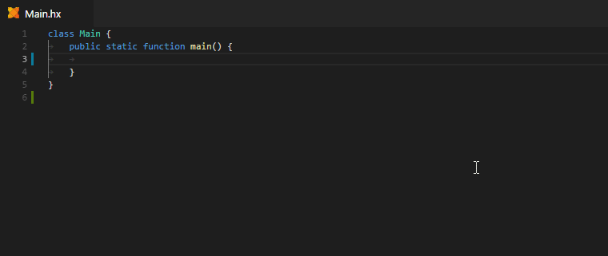

# Haxe Support for Visual Studio Code

   

This is an extension for [Visual Studio Code](https://code.visualstudio.com) that adds support for the [Haxe](http://haxe.org/) language,
leveraging the [Haxe Language Server](https://github.com/vshaxe/haxe-languageserver). It works best with [Haxe 4.0.0-preview.4](https://haxe.org/download/version/4.0.0-preview.4/), but supports any Haxe version starting from 3.4.0.

For usage with Lime/OpenFL, the [Lime extension](https://marketplace.visualstudio.com/items?itemName=openfl.lime-vscode-extension) should be installed.

### [**Click here for install instructions.**](https://github.com/vshaxe/vshaxe/wiki/Installation)

## Features

This is just a brief overview of the supported features. [**For more details, check out our extensive documentation**](https://github.com/vshaxe/vshaxe/wiki).

- [Syntax Highlighting](https://github.com/vshaxe/haxe-TmLanguage)
- [Commands](https://github.com/vshaxe/vshaxe/wiki/Commands) (<kbd>F1</kbd> -> search "Haxe")
- [Dependency Explorer](https://github.com/vshaxe/vshaxe/wiki/Dependency-Explorer)
- [Completion](https://github.com/vshaxe/vshaxe/wiki/Completion)
- [Completion Cache](https://github.com/vshaxe/vshaxe/wiki/Completion-Cache)
- [Signature Help](https://github.com/vshaxe/vshaxe/wiki/Signature-Help)
- [Hover Hints](https://github.com/vshaxe/vshaxe/wiki/Hover-Hints)
- [Go to Definition](https://github.com/vshaxe/vshaxe/wiki/Go-to-Definition) (<kbd>F12</kbd>)
- [Go to Type Definition](https://github.com/vshaxe/vshaxe/wiki/Go-to-Type-Definition)
- [Peek Definition](https://github.com/vshaxe/vshaxe/wiki/Peek-Definition) (<kbd>Alt</kbd>+<kbd>F12</kbd>)
- [Find All References](https://github.com/vshaxe/vshaxe/wiki/Find-All-References) (<kbd>Shift</kbd>+<kbd>F12</kbd>)
- [Rename Symbol](https://github.com/vshaxe/vshaxe/wiki/Rename-Symbol) (<kbd>F2</kbd>)
- [Document Symbols](https://github.com/vshaxe/vshaxe/wiki/Document-Symbols) (<kbd>Ctrl</kbd>+<kbd>Shift</kbd>+<kbd>O</kbd>)
- [Workspace Symbols](https://github.com/vshaxe/vshaxe/wiki/Workspace-Symbols) (<kbd>Ctrl</kbd>+<kbd>T</kbd>)
- [Outline](https://github.com/vshaxe/vshaxe/wiki/Outline)
- [Diagnostics](https://github.com/vshaxe/vshaxe/wiki/Diagnostics)
- [Code Actions](https://github.com/vshaxe/vshaxe/wiki/Code-Actions) (<kbd>Ctrl</kbd>+<kbd>.</kbd> on light bulbs)
- [Code Generation](https://github.com/vshaxe/vshaxe/wiki/Code-Generation)
- [Code Lens](https://github.com/vshaxe/vshaxe/wiki/Code-Lens) (<kbd>F1</kbd> -> [Haxe: Toggle Code Lens](https://github.com/vshaxe/vshaxe/wiki/Commands#haxe-toggle-code-lens))
- [Extension API](https://github.com/vshaxe/vshaxe/wiki/Extension-API)
