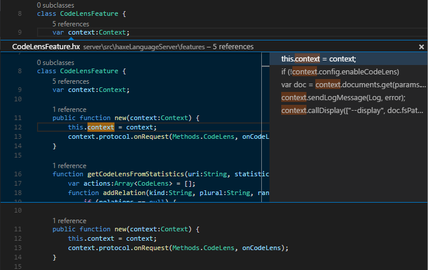
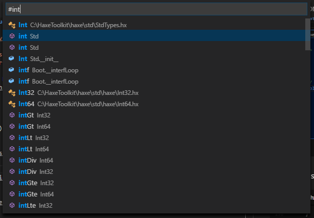
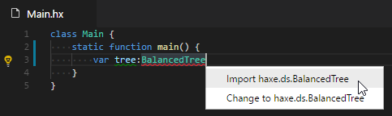
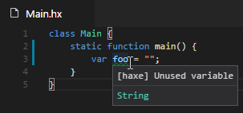
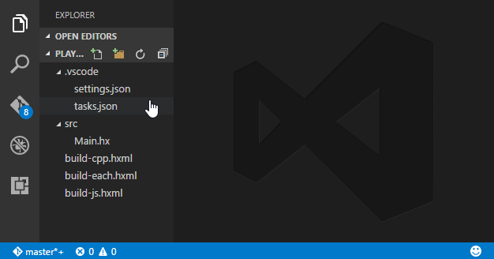

# Haxe Support for Visual Studio Code

[](https://travis-ci.org/vshaxe/vshaxe)

This is an extension for [Visual Studio Code](https://code.visualstudio.com) that adds support for the [Haxe](http://haxe.org/) language,
leveraging [Haxe Language Server](https://github.com/vshaxe/haxe-languageserver).

**IMPORTANT**: This requires Haxe version 3.4-rc1 or later (e.g. development) due to usage of [`-D display-stdin`](https://github.com/HaxeFoundation/haxe/pull/5120),
[`--wait stdio`](https://github.com/HaxeFoundation/haxe/pull/5188) and ton of other fixes and additions related to IDE support.

## Features

### Type hint


### Goto definition


### Completion


### Documentation


### Code Lens


### Peek definition


### Document symbols


### Workspace symbols


### Unused imports


### Import suggestions


### Dead Code Detection


## Commands

The vshaxe extension adds the following commands. You can invoke them by pressing `F1` or `Ctrl-Shift-P`/`Cmd-Shift-P` and
typing part of the command name. All commands are prefixed with `Haxe:`.

### Initialize VS Code project

> `haxe.initProject`

Scaffolds a very basic haxe project in an empty workspace. Can also be used on an existing project with .hxml files
to generate `.vscode` workspace folder with the build task and example vshaxe configuration.

### Restart language server

> `haxe.restartLanguageServer`

Restarts language server and haxe completion server. Use if anything goes wrong or to reload haxe-languageserver code
when developing.

### Select display configuration

> `haxe.selectDisplayConfiguration`

Choose the currently active display configuration (see [Configuration](#configuration) section below for more info).

### Run Global Diagnostics Check

> `haxe.runGlobalDiagnostics`

Runs diagnostics (unused import / dead code detection) on all files in the workspace.

## Configuration

The vshaxe extension supports the following settings. They can be configured in user or workspace settings file (`.vscode/settings.json`):

```js
{
    "haxe.displayConfigurations": [ // one or more configurations for the haxe completion server
        ["-cp", "src", "-js", "main.js"], // a configuration is array of arguments passed to the completion server
        ["build.hxml"], // hxml file is an normal haxe argument too
    ],
    "haxe.displayServer": { // configuration for starting haxe completion server itself
        "haxePath": "haxe", // path to the executable (default: `haxe`)
        "arguments": ["-v"], // arguments before --wait (-v is useful for debugging)
        "env": { // environment variables for the completion server
            "HAXE_STD_PATH": "/some/path",
            "SOME_VAR": "some_value",
        },

        // platform-specific overrides of the keys above
        // they will be merged into the default configuration
        "windows": {},
        "linux": {},
        "osx": {}
    }
}
```

Beware that display configurations specified in `haxe.displayConfigurations` should only contain arguments suitable for
completion, such as `-cp`, `-lib`, `-D` and target output (`-js`, `-cpp`, etc.). This is particularly important when
specifying an `.hxml` file for completion: make sure it doesn't contain `-cmd`, `--next`, `--each` and other arguments
not suitable for completion.

Multiple display configurations are useful when working with a codebase that is meant
to be compiled for different Haxe targets, or with a different set of defines. If
there is more than one configuration provided in the `haxe.displayConfigurations` setting,
when a `.hx` file is open, a selection appears in the status bar allowing to switch current
display configuration:



The same menu can also be shown by using `Select display configuration` command from the command palette or a keybinding.

## Build task

Example `tasks.json` file (the problem matcher is submitted to https://github.com/Microsoft/vscode/pull/5370)
```json
{
    "version": "0.1.0",
    "command": "haxe",
    "args": ["build.hxml"],
    "problemMatcher": {
        "owner": "haxe",
        "pattern": {
            "regexp": "^(.+):(\\d+): (?:lines \\d+-(\\d+)|character(?:s (\\d+)-| )(\\d+)) : (?:(Warning) : )?(.*)$",
            "file": 1,
            "line": 2,
            "endLine": 3,
            "column": 4,
            "endColumn": 5,
            "severity": 6,
            "message": 7
        }
    }
}
```

## Framework notes

Some frameworks support the creation of `.hxml` files, which is necessary to run the Haxe code completion engine. Below is a list of how you can get an `.hxml` file from various frameworks.

Framework     | How to get .hxml                      | Example usage
------------- | --------------------------------------|------------------------
Lime / OpenFL | `haxelib run lime display <platform>` | `haxelib run lime display linux > completion.hxml`
Snow          | `haxelib run flow info --hxml`        | `haxelib run flow info --hxml > completion.hxml`
Flambe        | `flambe haxe-flags`                   | `flambe haxe-flags > completion.hxml`

You then need to add `completion.hxml` to `haxe.displayConfigurations` in `settings.json` as shown below:

```json
{
    "haxe.displayConfigurations": [
        ["completion.hxml"]
    ]
}
```

**Kha** generates `.hxml` files automatically as `build/project-<platform>.hxml` on each build (so make to sure to build at least once). Also, `settings.json` needs to be adjusted to use the `build` directory:

```json
{
    "haxe.displayConfigurations": [
        ["--cwd", "build", "project-<platform1>.hxml"],
        ["--cwd", "build", "project-<platform2>.hxml"]
    ]
}
```

Problem matcher (`tasks.json` file) also needs to take location of hxml file into account:

```json
    "problemMatcher": {
        "fileLocation": ["relative", "${workspaceRoot}/build"],
```

For **Flixel**, please refer to [this](http://haxeflixel.com/documentation/visual-studio-code/) document. `flixel-tools` supports initializing a `.vscode` workspace for you.

Feel free to file an issue with details for other frameworks.

## Hacking

1. Navigate to the extensions folder (`C:\Users\<username>\.vscode\extensions` on Windows, `~/.vscode/extensions` otherwise)
2. _Recursively_ clone this repo: `git clone --recursive https://github.com/vshaxe/vshaxe`.
3. Change current directory to the cloned one: `cd vshaxe`.
4. Do `npm install` (to install `vscode-languageclient` module required to connect to the language server).
5. Do `haxe build.hxml` (that will build both client and server)
6. After modifying and rebuilding language server, reload it with the `Haxe: Restart language server` command (`Ctrl+Shift+P` to open the command palette).
7. After modifying and rebuilding the extension itself, restart VSCode, reload the window or run a debug instance with F5 ([standard vscode workflow](https://code.visualstudio.com/docs/extensions/debugging-extensions)).
