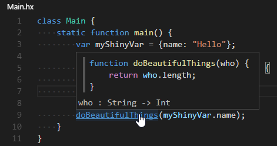
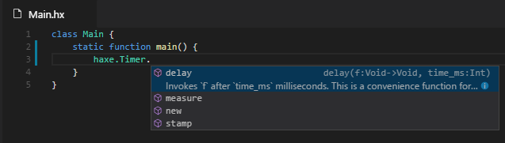
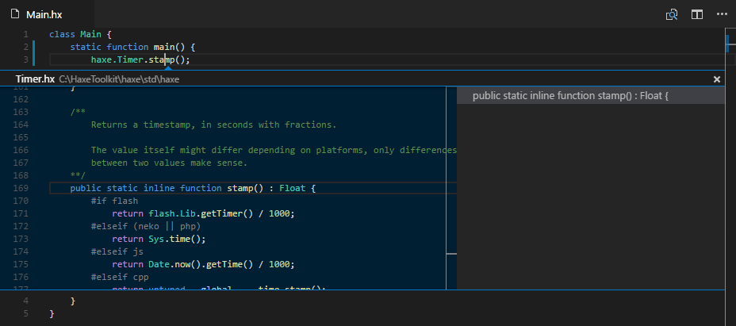
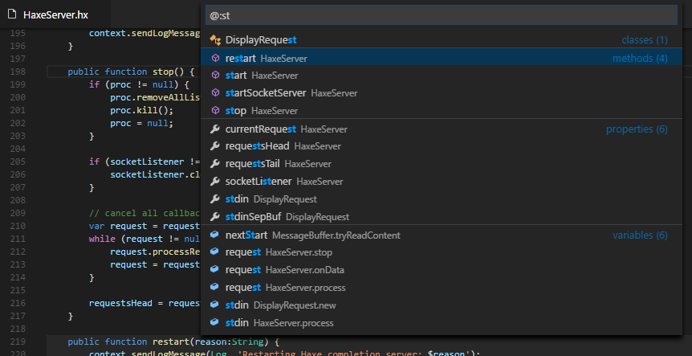
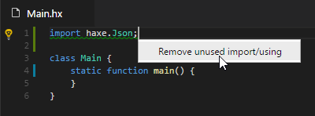

# Haxe Support for Visual Studio Code

This is an extension for [Visual Studio Code](https://code.visualstudio.com) that adds support for the [Haxe](http://haxe.org/) language,
leveraging [Haxe Language Server](https://github.com/vshaxe/haxe-languageserver).

**Status**: Should be usable, however it's still very new.

**IMPORTANT**: This requires Haxe version 3.3-rc1 or later (e.g. development) due to usage of [`-D display-stdin`](https://github.com/HaxeFoundation/haxe/pull/5120),
[`--wait stdio`](https://github.com/HaxeFoundation/haxe/pull/5188) and ton of other fixes and additions related to IDE support.

## Features

### Type hint


### Goto definition


### Completion


### Peek definition


### Document symbols


### Unused imports


## Commands

### Initialize VS Code project

Scaffolds a very basic haxe project. Can also be used on an existing project to generate `.vscode` workspace
folder with the build task and example vshaxe configuration.

### Restart language server

Restarts language server and haxe completion server. Use if anything goes wrong or to reload haxe-languageserver code when
developing.

## Build task

Example `tasks.json` file (the problem matcher is submitted to https://github.com/Microsoft/vscode/pull/5370)
```json
{
    "version": "0.1.0",
    "command": "haxe",
    "args": ["build.hxml"],
    "problemMatcher": {
        "owner": "haxe",
        "pattern": {
            "regexp": "^(.+):(\\d+): (?:lines \\d+-(\\d+)|character(?:s (\\d+)-| )(\\d+)) : (?:(Warning) : )?(.*)$",
            "file": 1,
            "line": 2,
            "endLine": 3,
            "column": 4,
            "endColumn": 5,
            "severity": 6,
            "message": 7
        }
    }
}
```

## Hacking

1. Recursively clone this repo in `~/.vscode/extensions`: `git clone --recursive https://github.com/vshaxe/vshaxe`.
2. Change current directory to the cloned one: `cd ~/.vscode/extensions/vshaxe`.
3. Do `npm install` (to install `vscode-languageclient` module required to connect to the language server).
4. Do `haxe build.hxml` (that will build both client and server)
5. Use `haxe.displayConfigurations` setting to provide haxe command-line arguments used for completion, such as `-cp`, `-lib`, etc.
As with normal haxe command-line arguments, you can specify an `.hxml` file, just beware that it should only contain arguments suitable for completion,
so no `--each`/`--next`/`-cmd`/etc.
